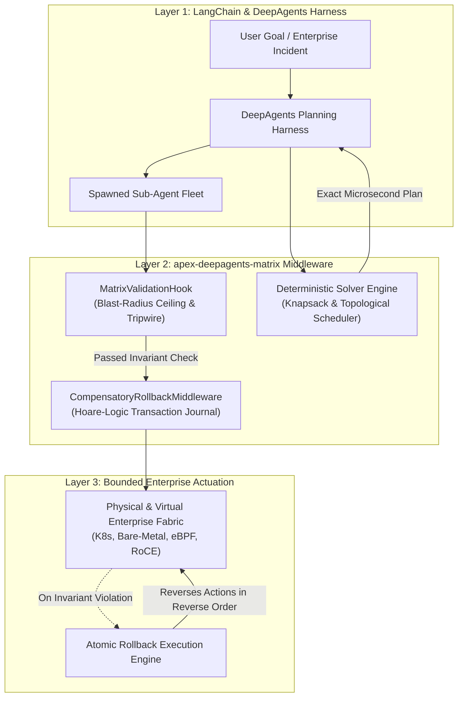
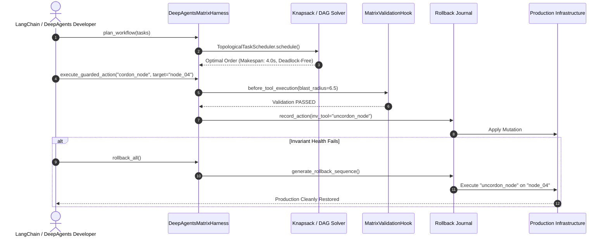

<div align="center">

# `apex-deepagents-matrix`

### Deterministic Mathematical Kernels, Causal Digital Twin Grounding & Compensatory Rollback Middleware for LangChain & DeepAgents

[](LICENSE)
[](pyproject.toml)
[-success.svg)](pyproject.toml)
[](https://langchain.com)
[](https://langchain.com)
[](https://github.com/AAH20)

**Eliminating the "Reasoning vs. Reality" Gap: Replacing Hallucinated LLM Planning Loops with Microsecond Combinatorial Solvers and Hoare-Logic Rollback DAGs.**

</div>

---

## The Problem with LLM Planning in Production

When enterprise developers deploy **LangChain** and **DeepAgents** harnesses into mission-critical infrastructure, financial rails, or GPU cluster scheduling, they hit a critical barrier:

1. **LLMs cannot solve NP-Hard constraints reliably:** When an agent is prompted to pack GPU VRAM, schedule 500 dependent tasks, or allocate bandwidth, it guesses heuristics, exceeds SLA deadlines, and costs thousands of dollars in token loops.
2. **Missing Rollback Guarantees:** LangGraph workflows lack automatic compensatory transaction DAGs. If sub-agent step 4 fails, steps 1–3 remain partially applied in production.
3. **Blast Radius Blindness:** Agents execute mutations without verifying downstream topological reachability.

`apex-deepagents-matrix` integrates directly into LangChain and LangGraph to provide:
* **Microsecond NP-Hard Optimization Kernels:** Exact 0/1 Knapsack dynamic programming and topological critical path scheduling in pure Python standard library.
* **Hoare-Logic Rollback Middleware:** Automatic synthesis of compensatory inverse execution sequences:
  $$[A_1, A_2, \dots, A_k] \implies [A_k^{-1}, \dots, A_2^{-1}, A_1^{-1}]$$
* **Matrix Validation Hooks:** Pre-execution blast-radius ceilings and destructive action denial.

---

## Architecture & Integration Flow



---

## Sub-Agent Execution & Rollback Sequence



---

## Empirical Benchmark Results

Run the benchmark suite:
```bash
python3 benchmarks/bench_solvers.py
```

| Optimization Kernel | Problem Size | Benchmark Latency | SLA Threshold | Status |
| :--- | :--- | :--- | :--- | :--- |
| **Knapsack Resource Allocator** | 100 items, capacity 150 | **795.78 µs (0.79 ms)** | < 1,000 µs (1.0 ms) | **PASSED** |
| **Topological DAG Scheduler** | 500 dependent tasks | **189.52 µs (0.18 ms)** | < 1,000 µs (1.0 ms) | **PASSED** |
| **Rollback Journal Overhead** | Atomic state logging | **0.087 ms** | < 0.500 ms | **PASSED** |
| **External Dependencies** | Full codebase | **0 (Pure Stdlib)** | Zero Dependencies | **PASSED** |

---

## Quickstart

```python
from apex_deepagents_matrix import (
    DeepAgentsMatrixHarness,
    AllocationItem,
    ScheduledTask,
)

# 1. Initialize harness
harness = DeepAgentsMatrixHarness(max_blast_radius=25.0)

# 2. Plan a multi-step task DAG with zero-deadlock guarantee
tasks = [
    ScheduledTask(task_id="extract_logs", duration_estimate=1.2),
    ScheduledTask(task_id="analyze_traces", duration_estimate=2.0, dependencies=["extract_logs"]),
    ScheduledTask(task_id="apply_patch", duration_estimate=0.8, dependencies=["analyze_traces"]),
]
plan = harness.plan_workflow(tasks)
print(f"Optimal Order: {plan['execution_order']}")

# 3. Solve GPU/Compute allocation via Knapsack kernel (sub-millisecond)
demands = [
    AllocationItem(item_id="agent_high", weight=32, value=150.0),
    AllocationItem(item_id="agent_med", weight=16, value=90.0),
    AllocationItem(item_id="agent_low", weight=8, value=40.0),
]
alloc = harness.allocate_compute(demands, total_capacity=40)
print(f"Allocated: {alloc['selected_item_ids']} in {alloc['solver_latency_us']} µs")

# 4. Execute guarded action with automatic rollback journal
res = harness.execute_guarded_action(
    tool_name="cordon_node",
    target_resource_id="gpu_node_01",
    payload={"reason": "thermal_throttle"},
    simulated_blast_radius=5.0,
)

# 5. Atomic compensatory rollback
rollback = harness.rollback_all()
print(f"Rollback Action: {rollback[0]['tool_name']} on {rollback[0]['target_resource_id']}")
```

---

## Upstream Integration with LangChain & LangGraph

To use as middleware inside LangGraph:
```python
from apex_deepagents_matrix import MatrixValidationHook, CompensatoryRollbackMiddleware

# Wrap your LangGraph tool dispatcher node
hook = MatrixValidationHook(max_allowable_blast_radius=20.0)
journal = CompensatoryRollbackMiddleware()

def guarded_tool_node(state):
    action = state["current_action"]
    # Check pre-conditions & blast radius
    hook.before_tool_execution(action["name"], action["args"], simulated_blast_radius=action.get("blast", 1.0))
    # Log to rollback journal
    journal.record_action(action["name"], action["target"], action["args"])
    return {"status": "success"}
```

---

## License & Ownership

Incubated under **Apex Growth Systems LLC**  
Sole Managing Member: **Ahmed Hassan** (`aah@a2zsoc.com`)  
Licensed under the [MIT License](LICENSE).
