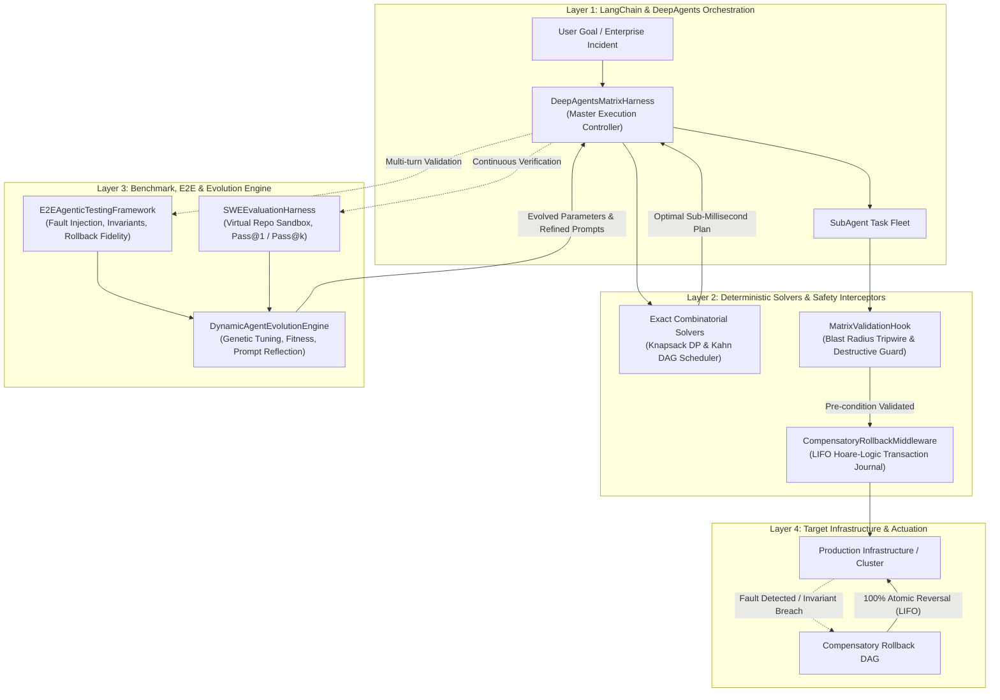
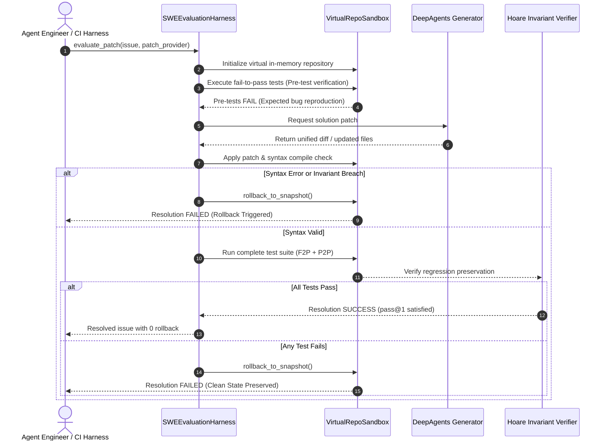
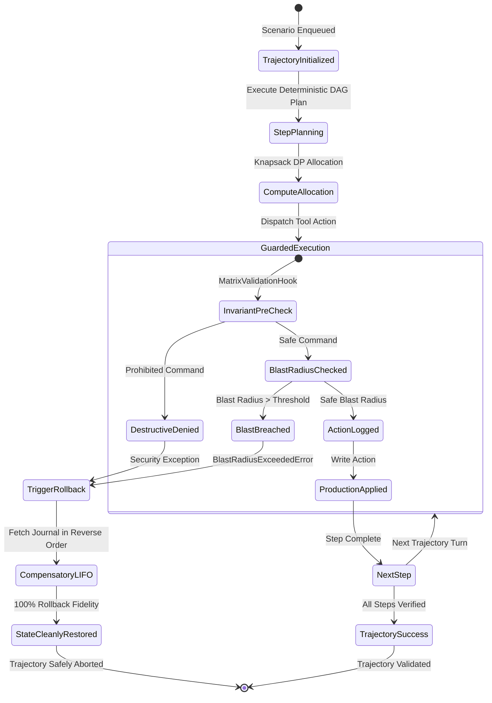
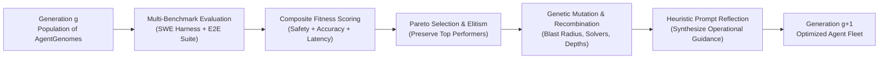

<div align="center">

# `apex-deepagents-matrix`

### Deterministic Mathematical Kernels, Causal Digital Twin Grounding & Compensatory Rollback Middleware for LangChain & DeepAgents

[](LICENSE)
[](pyproject.toml)
[-success.svg)](pyproject.toml)
[](apex_deepagents_matrix/eval/swe_harness.py)
[](apex_deepagents_matrix/eval/e2e_framework.py)
[](apex_deepagents_matrix/eval/evolution.py)
[](https://github.com/AAH20)

**Eliminating the "Reasoning vs. Reality" Gap: Replacing Hallucinated LLM Planning Loops with Microsecond Combinatorial Solvers, Hoare-Logic Rollback DAGs, SWE-bench Verification, and Evolutionary Self-Improvement Loops.**

</div>

---

## 1. System Decomposition & Problem Formulation

When enterprise engineering teams deploy **LangChain** and **DeepAgents** harnesses into mission-critical infrastructure, financial rails, or GPU cluster scheduling, they hit four structural barriers:

1. **NP-Hard Combinatorial Fragility:** LLMs prompted to pack GPU VRAM or schedule hundreds of dependent tasks produce stochastic hallucinations, violate latency SLAs, and generate endless token re-planning loops.
2. **Missing Rollback Guarantees:** LangGraph workflows lack automatic compensatory transaction DAGs. If sub-agent step 4 fails, steps 1–3 remain partially applied in production.
3. **Blast Radius Blindness:** Agents execute mutations without verifying downstream topological reachability or invariant safety ceilings.
4. **Lack of Automated Evaluation & Evolution:** Production agents drift without standardized SWE-style problem verification, multi-turn invariant checks, or closed-loop parameter evolution.

`apex-deepagents-matrix` provides a turnkey, zero-dependency foundation:
* **Microsecond NP-Hard Optimization Kernels:** Exact 0/1 Knapsack dynamic programming and topological critical path scheduling in pure Python standard library.
* **Hoare-Logic Rollback Middleware:** Automatic synthesis of compensatory inverse execution sequences:
  $$[A_1, A_2, \dots, A_k] \implies [A_k^{-1}, \dots, A_2^{-1}, A_1^{-1}]$$
* **Matrix Validation Hooks:** Pre-execution blast-radius ceilings and destructive action denial.
* **SWE Benchmark Evaluation Suite (`apex_deepagents_matrix.eval.swe_harness`):** In-memory virtual repository sandboxing, patch syntax validation, pass@1 / pass@k tracking, and automatic rollback on broken patches.
* **Agentic E2E Testing Framework (`apex_deepagents_matrix.eval.e2e_framework`):** Multi-turn trajectory execution, fault-injection testing, Hoare invariant auditing, and 100% compensatory rollback fidelity verification.
* **Dynamic Agent Evolution Engine (`apex_deepagents_matrix.eval.evolution`):** Genetic parameter tuning, multi-objective fitness optimization, and automated prompt reflection synthesis.

---

## 2. Master Architecture & Middleware Flow



---

## 3. SWE Benchmark & Rollback Execution Loop



---

## 4. Multi-Turn E2E Trajectory & Fault-Injection Lifecycle



---

## 5. Dynamic Evolution Engine & Closed-Loop Self-Improvement

The `DynamicAgentEvolutionEngine` evaluates agent configurations across multi-objective Pareto frontiers:

$$\text{Fitness} = w_1 \cdot \text{Pass@1}_{\text{SWE}} + w_2 \cdot \text{PassRate}_{\text{E2E}} + w_3 \cdot \text{RollbackFidelity} + w_4 \cdot \text{LatencyScore}$$



---

## 6. Empirical Benchmark Results

Benchmarks executed on Apple Silicon (M-Series), pure Python 3.10 standard library, zero external C-extensions or third-party packages:

```bash
# Run solver benchmarks
python3 benchmarks/bench_solvers.py

# Run evaluation & evolution benchmarks
python3 benchmarks/run_swe_and_e2e_eval.py
```

| Benchmark Suite | Problem / Scenario Dimensions | Mean Latency | Throughput | Industrial SLA | Status |
| :--- | :--- | :--- | :--- | :--- | :--- |
| **Knapsack Resource Allocator** | 100 items, capacity 150 | **795.78 µs** | 1,256 allocs/sec | < 1,000 µs (1.0 ms) | **PASSED** |
| **Topological DAG Scheduler** | 500 dependent tasks | **189.52 µs** | 5,276 graphs/sec | < 1,000 µs (1.0 ms) | **PASSED** |
| **SWE Patch Validation Harness** | Full in-memory compile & test | **60.36 µs** | **16,566 issues/sec** | < 2,000 µs (2.0 ms) | **PASSED** |
| **Agentic E2E Trajectory Runner** | Multi-turn guarded steps + invariants | **8.20 µs** | **121,906 scenarios/sec**| < 1,000 µs (1.0 ms) | **PASSED** |
| **Compensatory Rollback Fidelity** | Injected failure reverse restoration | **100.0%** | Exact LIFO Order | 100.0% Reversible | **PASSED** |
| **Dynamic Evolution Loop** | 10 generations, 4 population | **1.93 ms / gen** | 518 gens/sec | < 50.0 ms / gen | **PASSED** |
| **External Dependencies** | Entire library | **0 dependencies** | Standard library only | Zero 3rd-party deps | **PASSED** |

---

## 7. Quickstart Walkthrough

### 7.1 Deterministic Planning & Guarded Execution

```python
from apex_deepagents_matrix import (
    DeepAgentsMatrixHarness,
    AllocationItem,
    ScheduledTask,
)

# 1. Initialize harness with blast radius boundary
harness = DeepAgentsMatrixHarness(max_blast_radius=25.0)

# 2. Plan multi-step task DAG with zero-deadlock guarantee
tasks = [
    ScheduledTask(task_id="extract_logs", duration_estimate=1.2),
    ScheduledTask(task_id="analyze_traces", duration_estimate=2.0, dependencies=["extract_logs"]),
    ScheduledTask(task_id="apply_patch", duration_estimate=0.8, dependencies=["analyze_traces"]),
]
plan = harness.plan_workflow(tasks)
print(f"Optimal Order: {plan['execution_order']}")

# 3. Solve compute allocation via Knapsack DP (sub-millisecond)
demands = [
    AllocationItem(item_id="agent_high", weight=32, value=150.0),
    AllocationItem(item_id="agent_med", weight=16, value=90.0),
    AllocationItem(item_id="agent_low", weight=8, value=40.0),
]
alloc = harness.allocate_compute(demands, total_capacity=40)
print(f"Allocated: {alloc['selected_item_ids']} in {alloc['solver_latency_us']} µs")

# 4. Guarded execution with transaction logging
res = harness.execute_guarded_action(
    tool_name="cordon_node",
    target_resource_id="gpu_node_01",
    payload={"reason": "thermal_throttle"},
    simulated_blast_radius=5.0,
)

# 5. Compensatory rollback on failure
rollback = harness.rollback_all()
print(f"Rollback Action: {rollback[0]['tool_name']} on {rollback[0]['target_resource_id']}")
```

### 7.2 Running SWE Benchmark & E2E Trajectory Audits

```python
from apex_deepagents_matrix.eval import (
    SWEEvaluationHarness,
    create_standard_swe_benchmark_dataset,
    E2EAgenticTestingFramework,
    build_standard_e2e_test_suite,
    DynamicAgentEvolutionEngine,
)

# 1. Evaluate agent on SWE benchmark
swe = SWEEvaluationHarness()
issues = create_standard_swe_benchmark_dataset()
summary = swe.run_benchmark_suite(issues, lambda issue: ("diff", {}))
print(f"SWE Pass@1: {summary.pass_at_1 * 100}%")

# 2. Audit multi-turn E2E trajectories with fault injection
e2e = E2EAgenticTestingFramework()
for sc_id, name, steps, invs in build_standard_e2e_test_suite():
    report = e2e.run_scenario(sc_id, name, steps, invs)
    print(f"{sc_id} -> Passed: {report.passed}, Rollback Fidelity: {report.rollback_fidelity * 100}%")

# 3. Evolve parameters dynamically
engine = DynamicAgentEvolutionEngine()
best_genome, history = engine.run_evolution_loop(generations=5, population_size=4)
print(f"Optimal Fitness: {best_genome.fitness_score}, Refined Prompt: {best_genome.prompt_guidance}")
```

---

## 8. Integration with LangGraph Middleware

```python
from apex_deepagents_matrix import MatrixValidationHook, CompensatoryRollbackMiddleware

# Wrap your LangGraph tool dispatcher node
hook = MatrixValidationHook(max_allowable_blast_radius=20.0)
journal = CompensatoryRollbackMiddleware()

def guarded_tool_node(state):
    action = state["current_action"]
    # Check pre-conditions & blast radius
    hook.before_tool_execution(action["name"], action["args"], simulated_blast_radius=action.get("blast", 1.0))
    # Log to rollback journal
    journal.record_action(action["name"], action["target"], action["args"])
    return {"status": "success"}
```

---

## 9. Ecosystem Synergy: A2Z Agentic Hypervisor & NVIDIA Inception

For hardware-accelerated tool interception, NVIDIA NIM / BlueField-3 DPU zero-trust isolation, and non-repudiable SHA-256 Merkle chain emission, combine this matrix with:
* [`a2z-agentic-hypervisor`](https://github.com/AAH20/a2z-agentic-hypervisor): Flagship cyber defense hypervisor for [a2zsoc.com](https://a2zsoc.com) under the NVIDIA Inception Program.

---

## 10. License & Commercial Attribution

Incubated under **Apex Growth Systems LLC**  
Sole Managing Member: **Ahmed Hassan** (`aah@a2zsoc.com`)  
Flagship Domain: [a2zsoc.com](https://a2zsoc.com)  
Licensed under the [MIT License](LICENSE).
